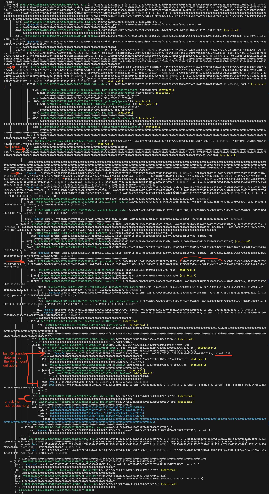
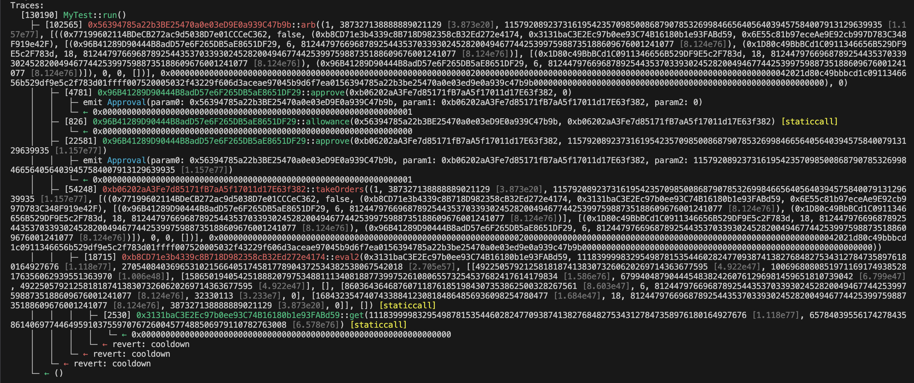

- you need foundry installed on your machine for this process, as well as having `forge-std` lib for contract dependencies.
- copy the `./diag/DiagOrder.sol` file below and put it in `./script` folder (or any other folder of your choice)
- replace the import path with the location of `forge-std/src/Script.sol` on you disk.
- replace the `to` address with the arb contract address on the desired network.
- replace the `data` with the calldata without leading 0x taken from otel (hyperdx).
- save the file and now you can run the following command to get the traces:
```bash
forge script path/to/DiagOrder.sol:DiagOrder -vvvvv --fork-url <url> --fork-block-number <blocknumber> --sender <addres>
```
- replace the `path` with the location of the saved file in previous step,
- replace the `<url>` with the network rpc url,
- replace the `<blocknumber>` with the block number taken from otel spans,
- replace the `<address>` with the bot's sender address, can be taken from otel spans
- click enter and wait to get the traces

after the traces are printed, the desired data can be extraced.
here are some examples to explain the steps required to get the desired data:

## example 1 (successfull call)


- find the `eval2()` call, as it is clear in the image above, the first arrow points to the eval() being called
- find the first call with `00000000` selector (second arrow), that is the eval result, and it is encoded, so the first 2 words (the first 2 256bytes) determine the price and maxouput in order, which in this case are 0x0 and 0x0x43cc30c876b457.
- the eval result is also available on the 3rd column of the `Context` event, (3rd arrow with 2 following red dots, first is order maxoutput and second is order ratio)
- 4th arrow determines the RP amountIn, for identifying it, you need to find the `processRoute()` call, once found, its second argument determines the `amountIn`, in this case it is 19083333333333079, (the 4th argument also determines the min expected receiving amount from the swap set by orderbook for the call)
- lastly the RP quote amountOut is visible in the last arrow, to find it, first try to find the `processRoute` call (same as last step), and from there and blow that you can find the very last event called `Swap` (at times, there can be multiple depending on the route, but we are only interested in the last one, since that would indicate the last swap which is the final receiving amount), once you found that event, the very last `Transfer` event before that determines the receiving transfer event of the RP swap, and its `param2` is the actual amountOut received by the swap, in this case it is 528.
to make sure you are looking at the correct `Transfer` event, you can check the 2 `balanceOf()` calls after the `Swap` event that we mentioned previously, check those and make sure their addresses match the order's input and output token addresses, those `balanceOf` calls are the very last calls in `processRoute` call checking if the swap input/output are not violated.
- now by having `amountIn` and `amountOut` you can easily calculate the AMM price/ratio by dividing them and compare it against the `eval()` price/ratio


## example 2 (failed call)


- this example is exactly as previous one, but it is an unsuccessfull call, so the error details are visible at the end of the traces, explaining the reason why the call failed.
- everything about identifying the eval result and RP quote is the same as previous example, but you can see that there are multiple `Swap` and `Transfer` events, and the ones that are in our interest are the very last ones (flagged by red arrow), you can also see the `balanceOf` calls at after the specified `Swap` event that match the order's input/output tokens.
in this case the amountOut is 33388, amountIn is 27685185185185008000, and eval result is 27685185185185008000 maxoutput and 2500000000000000 price, so by dividing amountOut from amountIn we reach to about 0.0012 as the current AMM market price, which is below what the order is asking for which is 0.0025, as a result the call failed since there is no arbing opportunity in this case.

## example 3 (failed eval2)


- sometimes traces dont go beyond eval, ie eval failing is the reason the call has failed, in such cases the reason of why eval has failed is clearly visible at the end of traces.
- in such cases traces wont produce the RP quote since the call has terminated before even reaching to that stage, so it is not possible to get the RP quote in such cases.


PS: these data are available elsewhere throughout the traces, so this is not the only way to extract them but seems to be the easiest one.